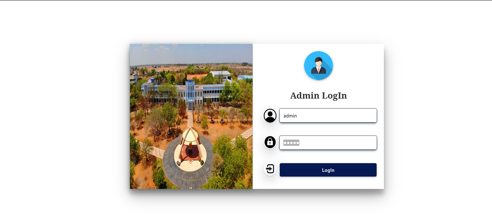
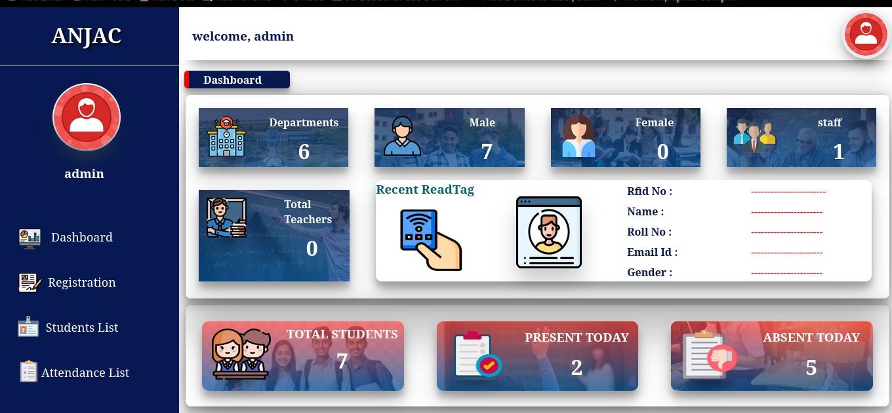
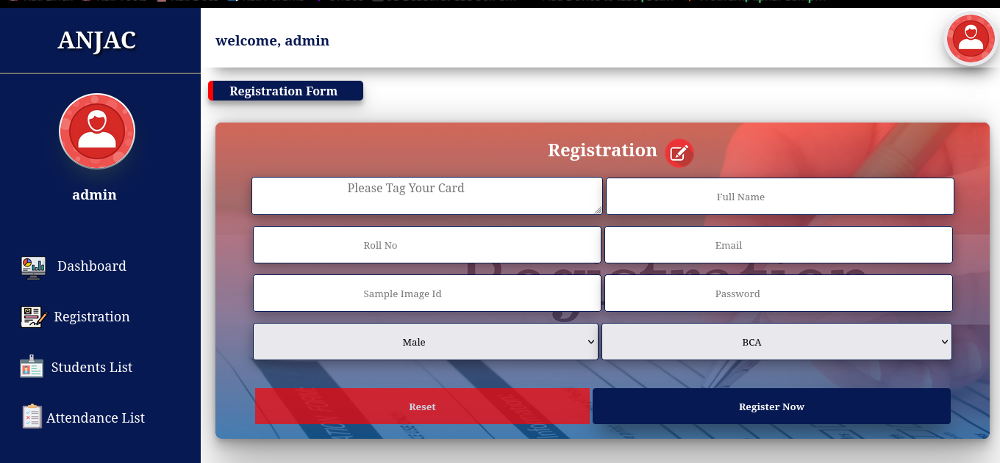
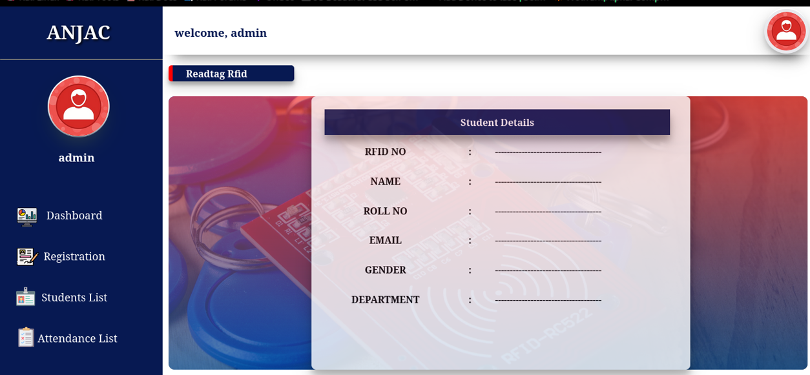
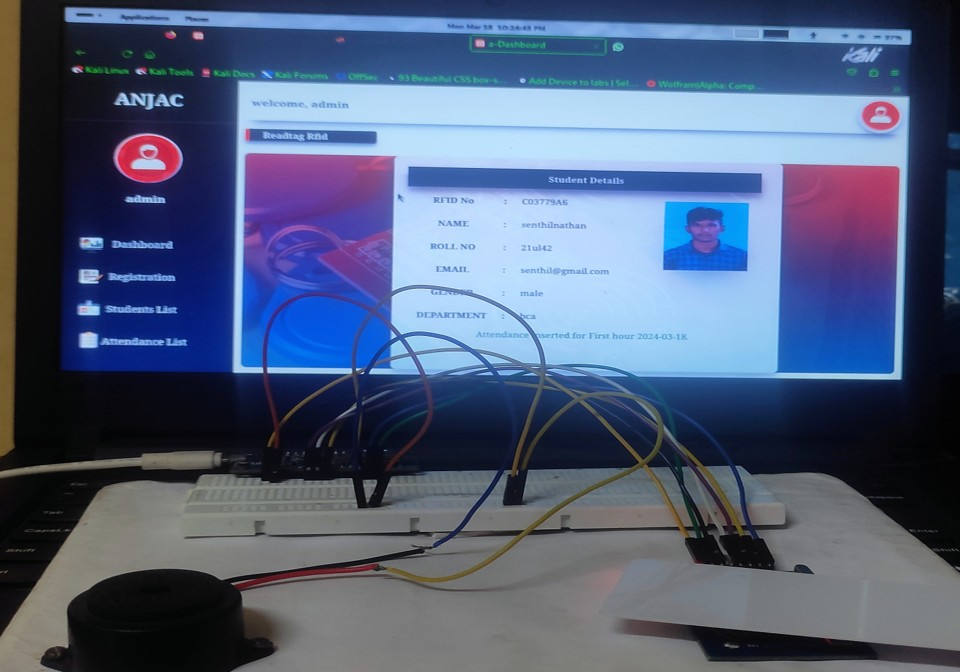
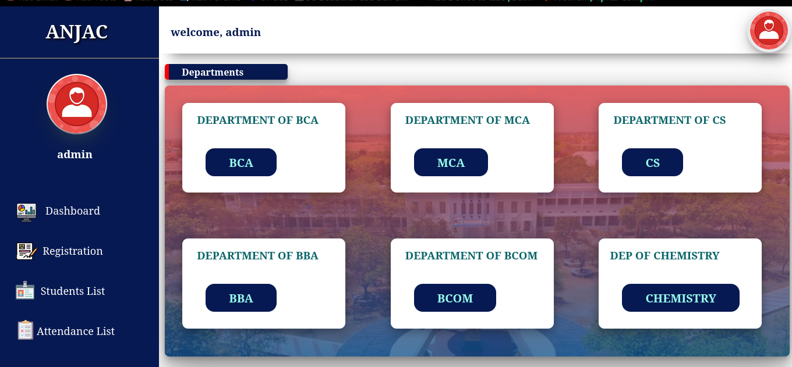
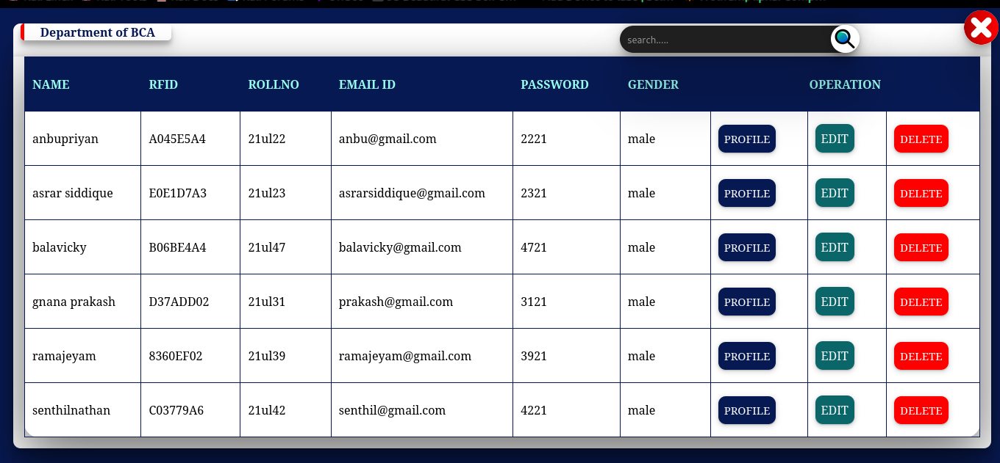
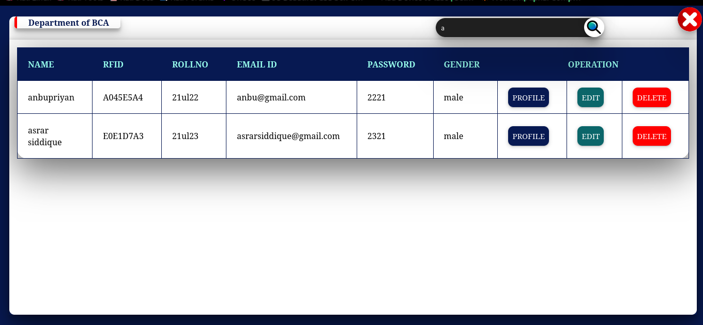
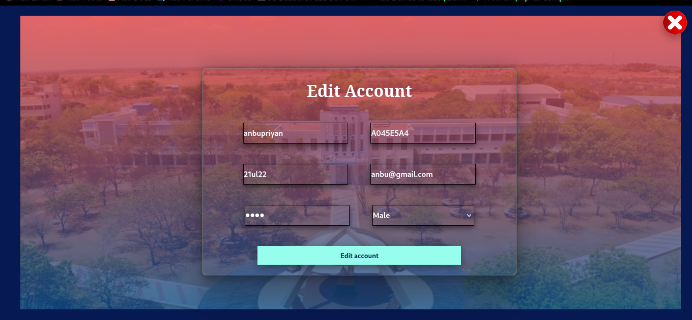

<h1 align="center">📡 RFID Based Attendance System</h1>
<h3 align="center">A Smart and Secure Way to Track Attendance using NodeMCU & RFID</h3>

  
  

  

<section style="background-color: #0f172a; color: #f1f5f9; padding: 2rem; border-radius: 1rem; max-width: 800px; margin: auto;">
  <h2 style="color: #22c55e; font-size: 2rem; font-weight: bold; margin-bottom: 1rem;">🛠️ Project Overview</h2>
  

    This project is an <strong>RFID-Based Attendance System</strong> that leverages <strong>NodeMCU (ESP8266)</strong> and <strong>RFID (RC522)</strong> to automate attendance logging. Whenever a student taps their RFID tag, the system records their attendance along with the timestamp in the database.
  

</section>

---

## 📋 Features

- 📶 NodeMCU (ESP8266) integrated with RC522 RFID module  
- 🕒 Real-time attendance logging with date & time  
- 💾 MySQL Database for persistent storage  
- 🌐 Web-based dashboard (PHP/HTML) to view attendance records  
- 🔒 Each tag is uniquely mapped to a student ID  

---

## 🧰 Tech Stack

| 🖥️ Frontend                                                                                                                                                                                                                                                                                                                                                                    | 🧠 Backend                                                                                                                                                                                                                                             | 💾 Database                                                                                                                                                             | ⚙️ Hardware                                                                                                                                                                                                                                                                                                                                                                                                                                                                                                                        |
| ------------------------------------------------------------------------------------------------------------------------------------------------------------------------------------------------------------------------------------------------------------------------------------------------------------------------------------------------------------------------------- | ------------------------------------------------------------------------------------------------------------------------------------------------------------------------------------------------------------------------------------------------------ | ----------------------------------------------------------------------------------------------------------------------------------------------------------------------- | ----------------------------------------------------------------------------------------------------------------------------------------------------------------------------------------------------------------------------------------------------------------------- 
|         |      |      |  

## 🖼️ Screenshots

## 🙋‍♂️ Author

### Senthil Nathan  
**Cybersecurity Analyst | Linux Enthusiast | IoT Developer**

- 🔗 [Portfolio Website](https://senthil.zeal.ninja)
- 📧 [senthilnathans1730@gmail.com](mailto:senthilnathans1730@gmail.com)
- 🐦 [Twitter: @senthil1730](https://twitter.com/senthil1730)
- 💼 [LinkedIn](https://www.linkedin.com/in/senthilnathan17092003/)
- 📷 [Instagram](https://instagram.com/gone_beta_)

---

## 📄 License

This project is licensed under the **MIT License** - see the [LICENSE](LICENSE) file for details.

